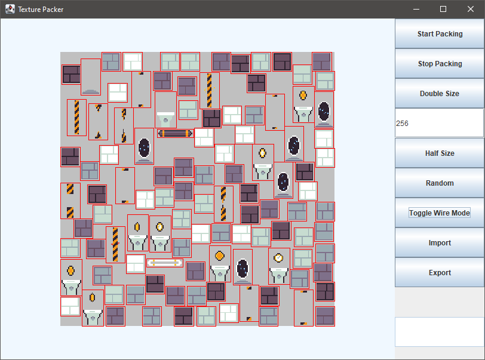

## Texture Packer

This program uses <a href="https://slsdo.github.io/steering-behaviors/">steering behavior</a> to pack images on a new file in addition to some sprite-extending margin for each sprite. Margin is required because without it (not in every project of course) there may be scan line artifacts. 

### Use

- **Start Packing** - start aligning the images. The program stops automatically when no image overlaps a different image
- **Stop Packing** - stops aligning the images. Is required to change the size of the output
- **Double Size** - doubles each side of the output image
- **Text field** - to input the desired size of the output 
- **Half Size** - halves each side of the output image
- **Random** - rearranges all images randomly
- **Toggle Wire Mode** - change between
  - show only outline
  - show outline and image
  - show only image
- **Import** - load .text sheets and other images into the program
- **Export** - save the result as .text file